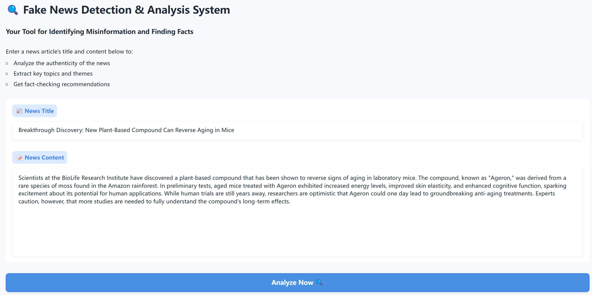
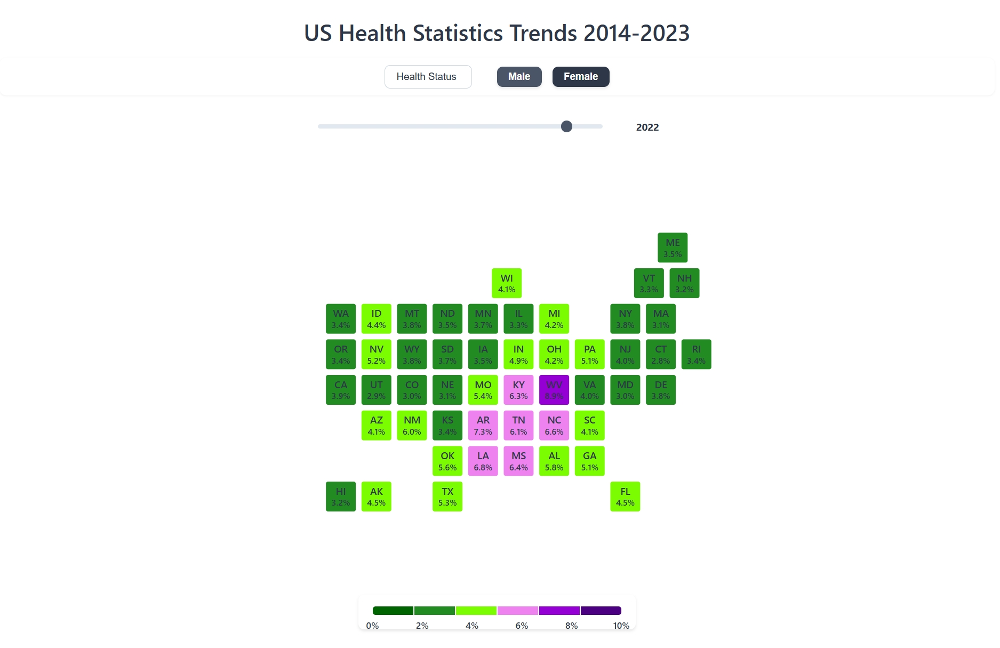
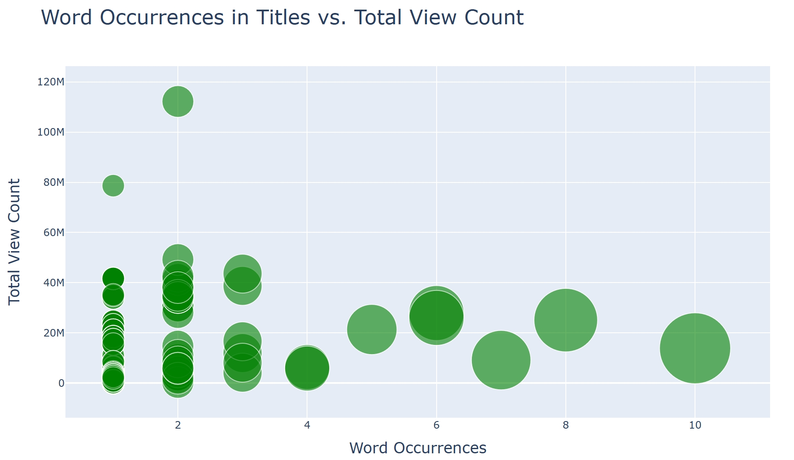

<h1>Projects</h1>
<h2 id="fake-news-debunker">AI-Powered Fake News Debunker<a href="#fake-news-debunker" class="header-anchor" arialabel="Anchor"> # </a></h2>

<figure itemprop="associatedMedia" itemscope itemtype="http://schema.org/ImageObject">

<figcaption>Click image for detailed introduction</figcaption>
</figure>

A tool that leverages AI to detect and analyze potentially fake news articles

<a href="https://github.com/deng34/fake-news-debunker" target="_blank" rel="noreferrer noopener">GitHub</a>
<a href="https://huggingface.co/spaces/Zeamays3427/fake-news-debunker" target="_blank" rel="noreferrer noopener">Hugging Face</a>

<h2 id="health-trends">Interactive Visualization of US Citizen Health Trends<a href="#health-trends" class="header-anchor" arialabel="Anchor"> # </a></h2>

<figure itemprop="associatedMedia" itemscope itemtype="http://schema.org/ImageObject">

<figcaption>Click image for detailed introduction</figcaption>
</figure>

An interactive dashboard visualizing health trends across different demographics in the US

<a href="https://github.com/deng34/us-health-statistics-visualization" target="_blank" rel="noreferrer noopener">GitHub</a>

<h2 id="youtube-analysis">YouTube Video Analysis and Visualization<a href="#youtube-analysis" class="header-anchor" arialabel="Anchor"> # </a></h2>

<figure itemprop="associatedMedia" itemscope itemtype="http://schema.org/ImageObject">

<figcaption>Click image for detailed introduction</figcaption>
</figure>

A data analysis and visualization tool for YouTube video metrics and trends

<a href="https://github.com/deng34/youtube-analysis-tool" target="_blank" rel="noreferrer noopener">GitHub</a>

