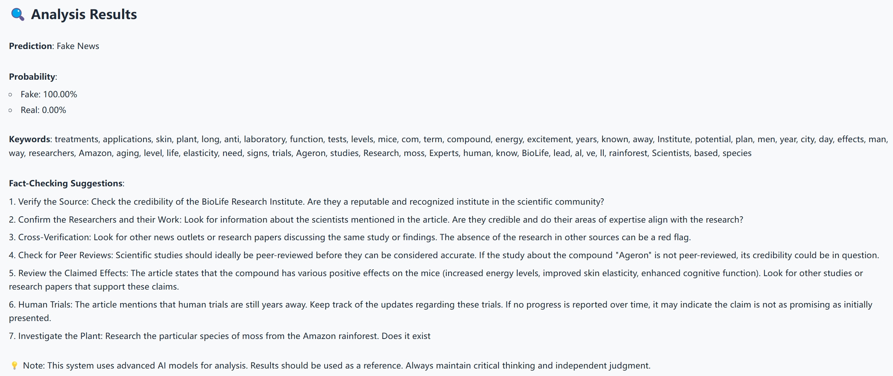

In today's fast-paced digital world, misinformation spreads at unprecedented speeds, making it increasingly difficult for people to combat. The Fake News Debunker project is an attempt to address this critical challenge by integrating multiple machine learning models.

At its core, the system employs a multi-layered approach to news analysis. It starts with a fine-tuned [model](https://huggingface.co/hamzab/roberta-fake-news-classification) based on RoBERTa (thanks to Hamza Benyamina), which works alongside GPT-4 to generate practical fact-checking suggestions. What sets this solution apart is its ability to not just identify potential misinformation, but also provide users with actionable steps to verify information independently.

*Web interface of the AI-powered fake news detection system*

The system also has an intuitive interface built on Gradio where users can simply paste a news article and its title. Within seconds, you receive a comprehensive analysis including:

- Authenticity probability scores
- Key topics and themes extracted from the content
- Customized fact-checking recommendations

You can try this project [here](https://huggingface.co/spaces/Zeamays3427/fake-news-debunker).
