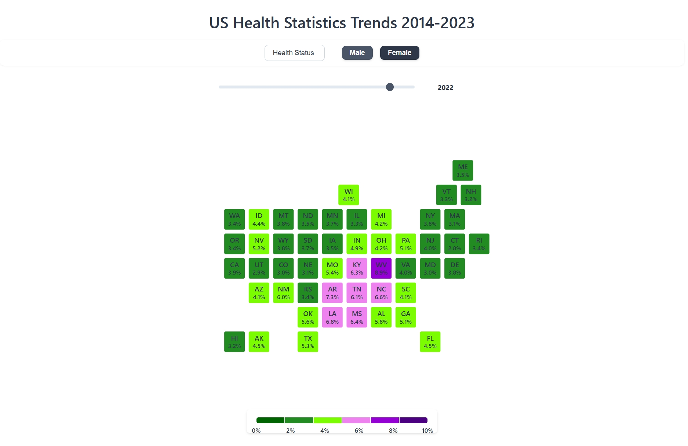

This project visualizes a decade of US health statistics (2014-2023) using CDC's Behavioral Risk Factor Surveillance System (BRFSS) data. The interactive visualization presents five key health indicators - general health status, heart disease, stroke, cancer, and arthritis - across all US states.

*Grid map of women's "poor health" percentage across US states (2022), with darker greens indicating lower rates.*

Inspired by Nathan Yau's [grid map](https://flowingdata.com/2017/12/07/small-multiples-map-grid/) approach (adapted from R to Python), each state is represented as an equal-sized unit to prevent geographical size from distorting data interpretation. The visualization includes features for examining gender differences and temporal changes through an interactive year slider. Color gradients indicate the prevalence rates of each health condition.

You can view the visualization [here](https://dengpeng.org/us-health-statistics-visualization/visualization.html).