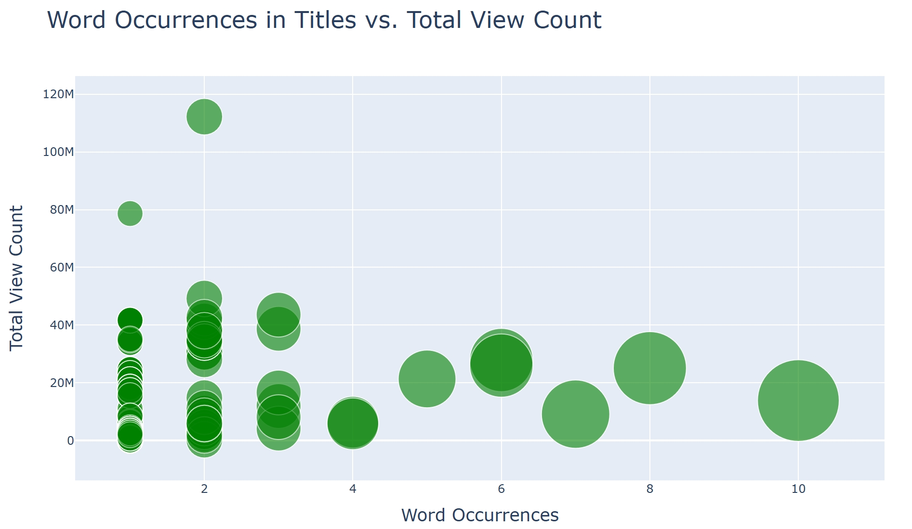

Ever wondered what makes certain YouTube videos go viral while others struggle for views? This YouTube Video Analysis Tool try to discover what topics attract the most views, by analyzing video tags and titles.

Essentially, the tool uses natural language processing to dissect video titles and tags in order to lookinto the patterns that influence viewership. For instance, we can identify which keywords consistently drive higher view counts, and which tags help boost video popularity.

*An output graph showing popular words that attract more views in video titles*

Key features:

Automated data collection from multiple YouTube channels
NLP-based text analysis of titles and tags
Interactive visualizations of engagement patterns
Trend analysis across different time periods

Link to the [Github](https://github.com/deng34/youtube-analysis-tool) repository.