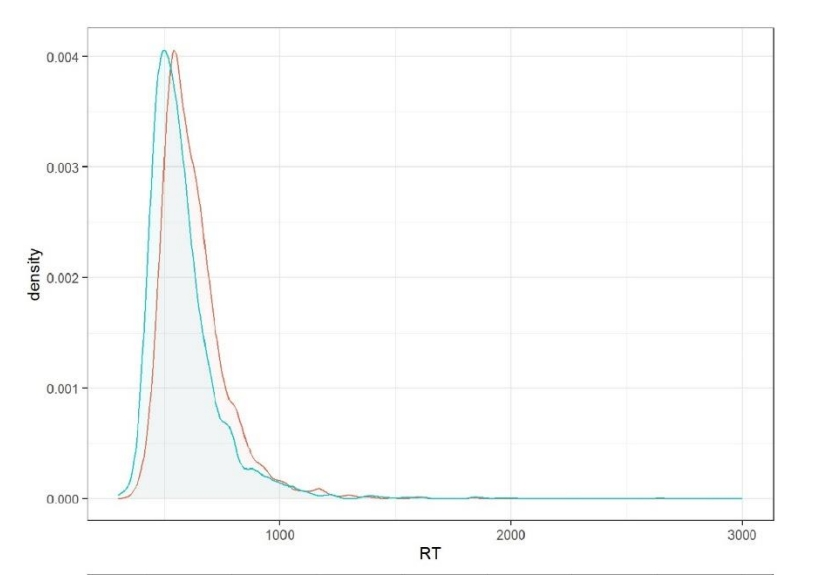

<h1>Research</h1>

<h2 id="masked-identity-priming">Masked Identity Priming in Japanese-English Developing Bilinguals<a href="#masked-identity-priming" class="header-anchor" arialabel="Anchor"> # </a></h2>

<figure itemprop="associatedMedia" itemscope itemtype="http://schema.org/ImageObject">

<figcaption>Click image for detailed introduction</figcaption>
</figure>

Work in progress

<strong>Masked Identity Priming Effects With Low Proficient L2 Readers</strong>

Peng Deng, <a href="https://researchmap.jp/jessie?lang=en" target="_blank" rel="noreferrer noopener">Jessie Wanner-Kawahara</a>, <a href="https://scholar.google.com/citations?user=wNSPkz8AAAAJ&hl" target="_blank" rel="noreferrer noopener">Mariko Nakayama</a>

You can <a href="/contact">contact</a> me for more information if you are interested.

<h2 id="visual-recognition">Visual Recognition of Chinese Characters<a href="#visual-recognition" class="header-anchor" arialabel="Anchor"> # </a></h2>

<figure itemprop="associatedMedia" itemscope itemtype="http://schema.org/ImageObject">

<figcaption>Click image for detailed introduction</figcaption>
</figure>

Master's thesis

<strong>Is Stroke Neighbor Priming Effect Inhibitory or Facilitatory: An Investigation Using Chinese Hanzi Characters</strong>

<a href="files/thesis.pdf" target="_blank" rel="noreferrer noopener">Full text</a>

ARWA 2020 Conference (Sept. 2020)

<strong>Visual Chinese character recognition: Is a stroke neighbor priming effect facilitatory or inhibitory?</strong>

Peng Peng, <a href="https://scholar.google.com/citations?user=wNSPkz8AAAAJ&hl" target="_blank" rel="noreferrer noopener">Mariko Nakayama</a>

<a href="files/slides.pdf" target="_blank" rel="noreferrer noopener">Slides</a>

Psychonomics 2020 Annual Meeting (Virtual, Nov. 2020)

<strong>Stroke Neighbor Priming Effect: An Investigation Using Chinese Hanzi and Japanese Kanji Characters</strong>

Peng Deng, <a href="https://nrid.nii.ac.jp/en/nrid/1000050732690/" target="_blank" rel="noreferrer noopener">Yu Kusunose</a>, <a href="https://researchmap.jp/myoshihara?lang=en" target="_blank" rel="noreferrer noopener">Masahiro Yoshihara</a>, <a href="https://scholar.google.com/citations?user=1RX5WI0AAAAJ&hl" target="_blank" rel="noreferrer noopener">Stephen J. Lupker</a>, <a href="https://researchmap.jp/read0160825?lang=en" target="_blank" rel="noreferrer noopener">Yasushi Hino</a>, <a href="https://scholar.google.com/citations?user=wNSPkz8AAAAJ&hl" target="_blank" rel="noreferrer noopener">Mariko Nakayama</a>

<a href="files/poster.pdf" target="_blank" rel="noreferrer noopener">Poster</a>

