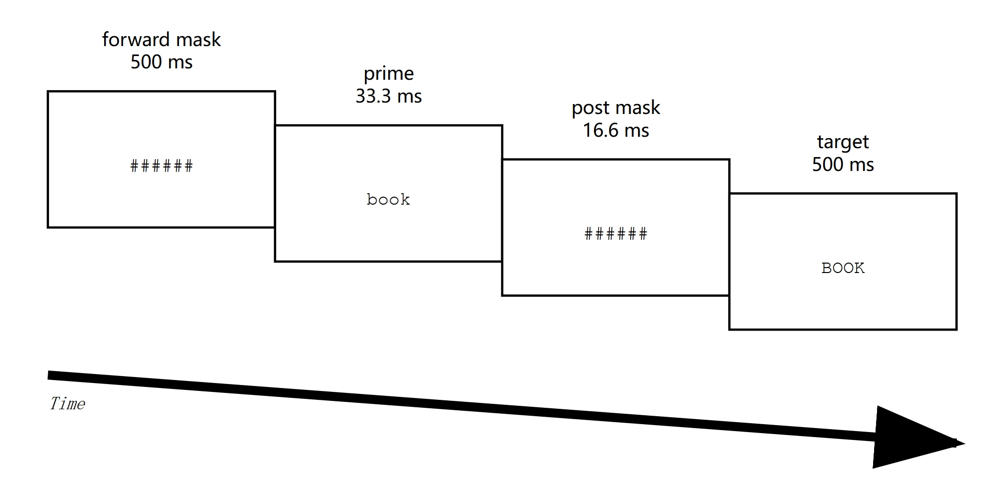
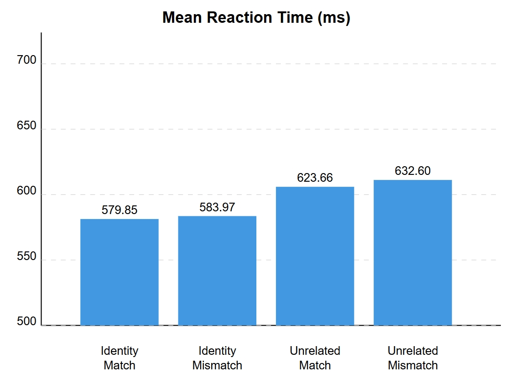

When we read English words like "BOOK" or "book", we recognize them as the same word almost instantly. This ability to quickly match different forms of the same word is crucial for efficient reading, but how does it work for people learning English as a second language, especially when their native language uses a completely different writing system?

*Structure of a trial*

My research examines this question by studying how Japanese students with limited English proficiency process English words. Using a technique called masked identity priming - where words are shown very briefly (for just 50 milliseconds) before being replaced by target words - we found that these learners can quickly access the abstract representations of English words regardless of whether they appear in uppercase or lowercase, much like native English readers do.

*RT in different conditions*

Through statistical tools like Bayesian analysis and diffusion modeling, we discovered that these beginning English learners showed patterns remarkably similar to native English speakers. This suggests that our brains are more adaptable than previously thought when it comes to learning new writing systems - an encouraging finding for anyone embarking on the journey of learning a new language.

Feel free to send me an [Email](https://dengpeng.org/contact/) if interested.
