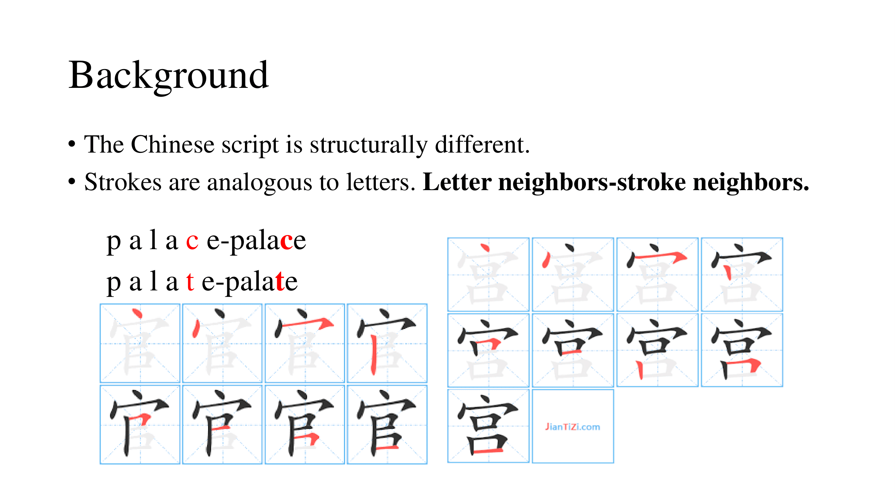
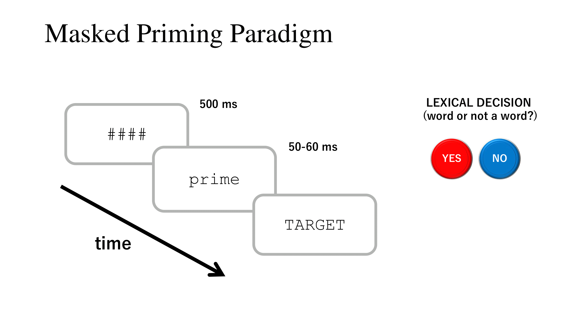
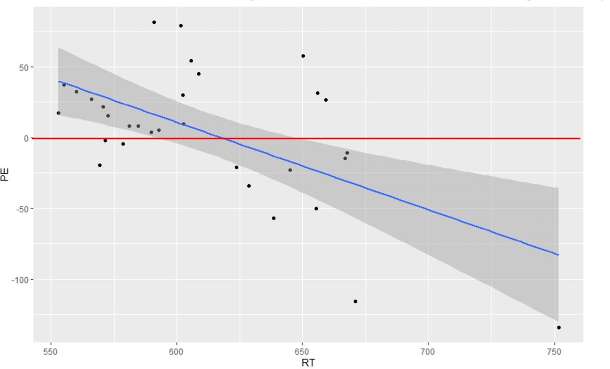

 
How does our brain recognize Chinese characters—one of the most complex writing systems in the world? Unlike alphabetic languages where letters combine sequentially, Chinese characters present a fascinating puzzle of intricate spatial arrangements of strokes. Our research explored this mystery by examining the role of strokes in Chinese character recognition.

*宫 and 官 look similar, only differing by one stroke*

Using a technique called masked priming—which involves briefly presenting one stimulus before another to observe the effects on recognition—we investigated a particularly intriguing phenomenon: when readers encounter a Chinese character, how does it affect their recognition of other characters that look nearly identical but differ by just one or two strokes? These "stroke neighbors" (like 官 and 宫) provide a unique window into the cognitive mechanisms underlying character recognition.

*A lexical decision task in masked priming paradigm*

Previous studies on this topic have yielded conflicting results. Some found that encountering one character gives its neighbor a "head start" in recognition, suggesting a facilitatory effect. Others discovered that neighbors actually compete with each other during recognition, as both of their mental representations are activated simultaneously, leading to interference. Our research suggests that timing might be the key to this puzzle—the longer the brain has to process the first character, the more likely it is that competition will emerge, resulting in interference with recognizing its "neighbor."

*RT = reaction time, PE = priming effect = mean RT in experimental condition - mean RT in control condition"*

These findings suggest that Chinese character processing might follow unique patterns compared to alphabetic languages, which show more consistent interference from "neighbors". Understanding these patterns not only advances our knowledge of human visual cognition but could also have practical applications in Chinese language education and reading disorder research.